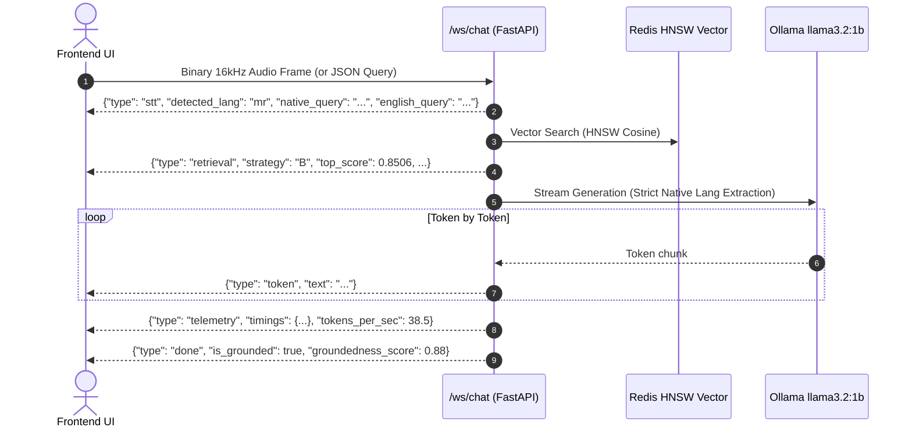

# ⚡ Zatpat.ai — Backend ➔ Frontend API & WebSocket Contract

Welcome to the **Zatpat.ai** Multilingual Voice RAG API specification. This document contains all the endpoint definitions, WebSocket message schemas, telemetry formats, and code snippets needed to build a modern frontend interface.

---

## 1. Connection & Base URLs

| Service | Protocol | URL / Port |
| :--- | :--- | :--- |
| **Development Backend** | HTTP REST | `http://localhost:8000` |
| **Real-time Duplex Chat** | WebSocket | `ws://localhost:8000/ws/chat` |
| **Swagger Interactive Docs** | OpenAPI | `http://localhost:8000/docs` |

---

## 2. Real-Time WebSocket API: `/ws/chat`

The primary interactive communication channel is the full-duplex WebSocket endpoint at **`ws://localhost:8000/ws/chat`**.

### 2.1 Client ➔ Server Payloads

The frontend can send **either** binary microphone audio or text JSON commands over the same socket:

#### Option A: Binary Audio Frame (Voice Command)
Send raw **16kHz 16-bit Mono WAV** bytes as a binary frame:
```javascript
// Web Audio API ArrayBuffer (16kHz Mono PCM in WAV container)
websocket.send(wavArrayBuffer);
```

#### Option B: Text JSON Frame (Typed Question)
```json
{
  "type": "query",
  "query": "what is a corporation?",
  "lang": "mr",
  "session_id": "optional-uuid-for-multi-turn"
}
```

---

### 2.2 Server ➔ Client Event Stream

As the backend processes the voice or text request, it pushes structured JSON frames in chronological order:



#### Event 1: `stt` (Speech-to-Text Detection)
Emitted immediately after voice translation completes:
```json
{
  "type": "stt",
  "detected_lang": "mr",
  "native_query": "कॉर्पोरेशन काय आहे?",
  "english_query": "what is a corporation?",
  "is_mock": false
}
```

#### Event 2: `retrieval` (Redis Vector Search Match)
Emitted when the relevant passage is retrieved from Redis:
```json
{
  "type": "retrieval",
  "strategy": "B",
  "query_type": "DESCRIPTION",
  "top_score": 0.8506,
  "top_passage_sample": "कॉर्पोरेशन म्हणजे एक कंपनी किंवा लोकांचा समूह ज्याला एकल संस्था म्हणून मान्यता प्राप्त आहे..."
}
```
* **`strategy`**: Strategy `A` (Metadata Selective), `B` (Parent-Child Hierarchical), `C` (Sliding Window), or `D` (Micro-Sentence Numeric/Entity).
* **`top_score`**: Cosine similarity score ($0.0 \rightarrow 1.0$).

#### Event 3: `token` (Streaming LLM Token)
Emitted token-by-token as Ollama generates the response:
```json
{
  "type": "token",
  "text": "कॉर्पोरेशन "
}
```

#### Event 4: `telemetry` (Sub-Millisecond Stage Latencies)
Emitted right after generation completes with granular timing measurements:
```json
{
  "type": "telemetry",
  "timings": {
    "stt_ms": 180.25,
    "input_guardrail_ms": 0.15,
    "session_load_ms": 0.45,
    "retrieval_ms": 5.20,
    "output_guardrail_ms": 0.02,
    "ttft_ms": 32.10,
    "llm_generation_ms": 412.50,
    "groundedness_ms": 0.18,
    "total_pipeline_ms": 630.85
  },
  "tokens_per_sec": 38.5
}
```
> **Recommended UI Display**: To show a clean latency table, render stages **1 through 5** (`stt_ms`, `input_guardrail_ms`, `session_load_ms`, `retrieval_ms`, `output_guardrail_ms`) which represent the sub-200ms voice search & verification pipeline!

#### Event 5: `done` (Turn Complete)
Emitted when the turn is finalized:
```json
{
  "type": "done",
  "session_id": "session_mr_12345",
  "is_grounded": true,
  "groundedness_score": 0.88
}
```

#### Interception Events: `blocked` & `abstained`
Emitted if a safety violation occurs or if the question is out of domain:
```json
// Example: Blocked by Safety Guardrail (PII / Injection)
{
  "type": "blocked",
  "status": "blocked",
  "reason": "SAFETY_VIOLATION",
  "message": "यह अनुरोध हमारी सुरक्षा नीति के विरुद्ध है। कृपया उचित प्रश्न पूछें।"
}

// Example: Abstained by Confidence Guardrail (Score < 0.45)
{
  "type": "abstained",
  "status": "abstained",
  "reason": "LOW_CONFIDENCE",
  "message": "मला या प्रश्नाचे उत्तर देण्यासाठी पुरेशी माहिती नाही."
}
```

---

## 3. REST API Endpoints

### 3.1 Health & Status: `GET /health`
Returns backend cluster status, Redis vector index size, and Ollama status.

**Response:**
```json
{
  "status": "ok",
  "redis": "connected",
  "index_name": "idx:msmarco_passages",
  "doc_count": 913,
  "ollama": "ready",
  "supported_languages": ["hi", "mr", "sa", "ta"]
}
```

---

### 3.2 Supported Languages: `GET /api/languages`
Returns available languages with native display names.

**Response:**
```json
{
  "languages": [
    { "code": "hi", "name": "Hindi", "native_name": "हिन्दी" },
    { "code": "mr", "name": "Marathi", "native_name": "मराठी" },
    { "code": "sa", "name": "Sanskrit", "native_name": "संस्कृतम्" },
    { "code": "ta", "name": "Tamil", "native_name": "தமிழ்" }
  ]
}
```

---

### 3.3 Active Chunking Strategies: `GET /api/strategies`
Returns descriptions of the 4 indexing strategies for rendering strategy badges in the UI.

**Response:**
```json
{
  "strategies": [
    {
      "id": "A",
      "name": "Metadata-Aware Selective",
      "description": "Preserves atomic query-passage pairs for precise factual lookup."
    },
    {
      "id": "B",
      "name": "Parent-Child Hierarchical",
      "description": "Embeds small sentence chunks, returns rich parent context."
    },
    {
      "id": "C",
      "name": "Context-Enriched Sliding Window",
      "description": "Multi-sentence windows with token overlap for comprehensive descriptions."
    },
    {
      "id": "D",
      "name": "Micro-Chunking",
      "description": "Single-sentence numeric/entity micro-chunks for factoids."
    }
  ]
}
```

---

### 3.4 Active Guardrails Config: `GET /api/guardrails`
Returns active threshold parameters for the UI telemetry inspector.

**Response:**
```json
{
  "input_guardrails": {
    "supported_languages": ["hi", "mr", "sa", "ta"],
    "max_query_words": 200,
    "min_query_words": 1,
    "pii_filtering": true,
    "prompt_injection_filter": true
  },
  "output_guardrails": {
    "confidence_threshold": 0.45,
    "groundedness_threshold": 0.30,
    "no_answer_detection": true
  }
}
```

---

### 3.5 Synchronous Query: `POST /api/query`
Standard REST query endpoint (if not using WebSocket streaming).

**Request:**
```json
{
  "query": "what is a corporation?",
  "lang": "hi",
  "session_id": "optional-session-id",
  "top_k": 5
}
```

**Response:**
```json
{
  "session_id": "session_hi_12345",
  "query": "what is a corporation?",
  "lang": "hi",
  "status": "success",
  "full_answer": "निगम एक कंपनी या लोगों का समूह होता है जो एक एकल इकाई के रूप में कार्य करता है।",
  "top_score": 0.8506,
  "groundedness_score": 0.88,
  "is_grounded": true,
  "retrieved_passages": [
    {
      "chunk_id": "chunk:1102432:B:0",
      "score": 0.8506,
      "strategy": "B",
      "query_type": "DESCRIPTION",
      "native_text": "निगम एक कंपनी या लोगों का समूह होता है...",
      "parent_native_text": "..."
    }
  ],
  "timings_ms": {
    "input_guardrail_ms": 0.14,
    "session_load_ms": 0.46,
    "retrieval_ms": 5.20,
    "output_guardrail_ms": 0.02,
    "ttft_ms": 32.10,
    "llm_generation_ms": 412.50,
    "groundedness_ms": 0.18,
    "total_pipeline_ms": 450.60
  }
}
```

---

## 4. Frontend Implementation Snippet (JavaScript / TypeScript)

### Connecting to the WebSocket in React / Vanilla JS:

```javascript
class ZatpatVoiceClient {
  constructor(onToken, onEvent) {
    this.ws = new WebSocket('ws://localhost:8000/ws/chat');
    this.onToken = onToken;
    this.onEvent = onEvent;

    this.ws.onmessage = (event) => {
      const data = JSON.parse(event.data);
      if (data.type === 'token') {
        this.onToken(data.text);
      } else {
        this.onEvent(data);
      }
    };
  }

  sendAudio(wavBuffer) {
    if (this.ws.readyState === WebSocket.OPEN) {
      this.ws.send(wavBuffer);
    }
  }

  sendText(query, lang = 'hi') {
    if (this.ws.readyState === WebSocket.OPEN) {
      this.ws.send(JSON.stringify({ type: 'query', query, lang }));
    }
  }
}
```

---

## 5. UI Best Practices for Zatpat.ai

1. **Strategy Badges**: When `retrieval` event arrives, display a colored badge for Strategy `A`, `B`, `C`, or `D`.
2. **Live Waveform Visualizer**: Use the Web Audio API `AnalyserNode` to draw an animated audio spectrum while recording.
3. **Telemetry Table**: Render the 5 pre-generation pipeline stages (`stt_ms`, `input_guardrail_ms`, `session_load_ms`, `retrieval_ms`, `output_guardrail_ms`) alongside the overall sub-200ms latency badge.
4. **Typewriter Streaming**: Append tokens incrementally as `token` events arrive for an instantaneous responsive feel.
